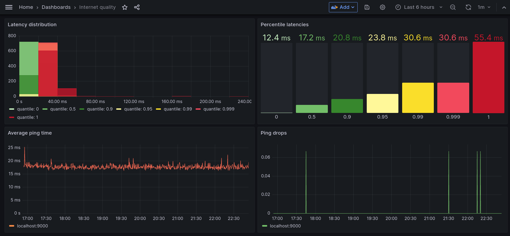

# Interiris

Measure how reliable your internet connection is.



This tool will automatically locate the first hop outside your own network, and
use ping to measure the latency to that hop. It will record latency and packet
drops, and we also include an [example Grafana
dashboard](./grafana_dashboard.json) that you can use to visualize the results.

This project relies on a setup of Prometheus and Grafana, and includes examples
of how to get them set up.

This project is built with the [Netdiag](https://crates.io/crates/netdiag) and
[Metrics](https://metrics.rs/) crates. [Kentik Labs](https://kentiklabs.com/)
has a good [blog
post](https://kentiklabs.com/blog/open-sourcing-our-netdiag-crate/) about their
Netdiag crate.


##  Get a release

If you're running Linux - you can download a binary release from Github. You
can also build it easily yourself, either to a binary or a docker image.


## Building a binary

If you want to build the binary yourself, you'll need to have Rust installed.
For that, you can follow the instructions on the Rust website to [install
Rust](https://www.rust-lang.org/tools/install). Then:

For a debug build:

    make

For a release build:

    make release

You'll find the debug build in `target/debug` and the release build in
`target/release`, depending on what you chose.


## Running

If you've got a debug build:

    RUST_LOG=info ./target/debug/interiris

if you want backtraces available in case of a crash:

    RUST_BACKTRACE=1 RUST_LOG=info ./target/debug/interiris

If you have a release build, replace `debug` in the path with `release`.

While it's not necessary, I would recommend running with `RUST_LOG=info` -
there are multiple log levels available described in the
[env_logger](https://docs.rs/env_logger/latest/env_logger/) crate docs.


If you want to run the docker image, use:

    docker run -it -p 9000:9000 --name interiris --rm ghcr.io/anglerud/interiris:latest


## Building a docker image

The provided docker image should make it easy to build a docker image:

Either:

    make docker

or:

    docker build -t interiris:latest .


## Further usage

The default options are likely to be good enough, but there are some options to
tweak the behavior.

    Usage: interiris [OPTIONS]
    
    Optional arguments:
      -h, --help
      -p, --proto PROTO    Protocol to use to find first public IP: ICMP, UDP, or TCP (default: ICMP)
      -P, --probe-port PROBE-PORT
                           Port the TCP or UDP trace probe will connect to. Required for TCP or UDP
      -c, --count COUNT    Retries while tracing to first public IP (default: 4)
      -d, --delay DELAY    Time between monitoring pings (default: 500)
      -l, --limit LIMIT    Max network hops before giving up finding a public IP (default: 30)
      -e, --expiry EXPIRY  Max time to wait for a network reply (default: 250)


## Using

The monitor will expose metrics on port 9000. In order to make use of these
metrics, you will need Prometheus set up, and a dashboard to visualize them. I
provide a Grafana dashboard you can import to get started.


### Prometheus

You can find out how to get Prometheus at
[https://prometheus.io/](https://prometheus.io/). Running it is very simple,
and I would recommend downloading the appropriate install for your operating
system, then adding a job definition to the `scrape_configs` section of your
`prometheus.yml` configuration file that looks like this:

```yaml
- job_name: "internet"

  static_configs:
    - targets: ["localhost:9000"]
```

Then run the Prometheus binary with `./prometheus`.


### Grafana

To visualize the data collected by Prometheus, grab
[Grafana](https://grafana.com/oss/grafana/).

There are multiple ways for you to deploy Grafana, but I find the easiest way
to run it is with Docker, if you have that available. I launch Grafana with:

    $ mkdir grafana_data
    $ docker run -it --rm -p 3000:3000 --user $(id -u) --volume "${PWD}/grafana_data:/var/lib/grafana" \
        --name grafana grafana/grafana-oss:9.5.1

You can then access Grafana on http://localhost:3000/. The default username and
password are both "admin".

You will need to set up a new data source called "Prometheus". You can do that
under "Administration -> Data Sources", which is accessible via the left-hand
hamburger menu. Select Prometheus, and update the HTTP URL parameter to
`http://<your ip>:9090/`. You can get your IP with `ip a` on Linux. You can
leave the other settings as default.

Next - import the [sample dashboard](./grafana_dashboard.json) by clicking the
`+` top right in Grafana.

You're now done - you should be able to see your ping data coming in! You'll be
able to see:

* average ping time over time
* packet drops over time
* the current distribution of ping times
* percentile distributions over time


### The name

Latin - I go among, become lost in.
